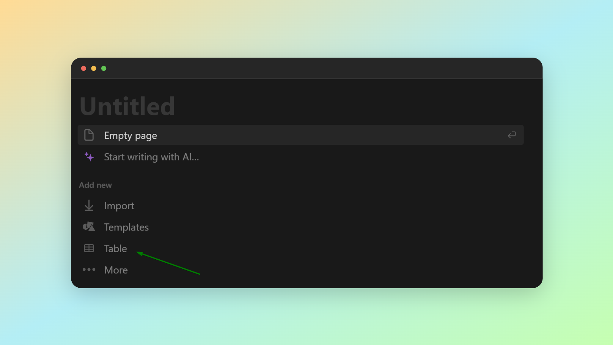
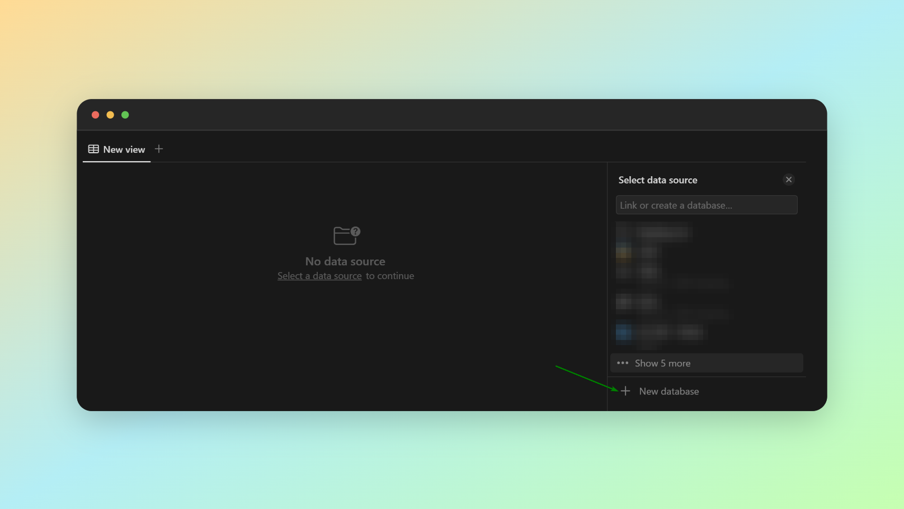
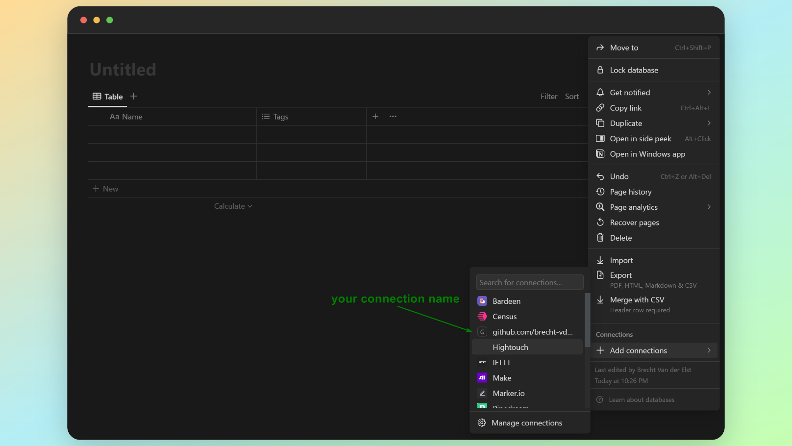
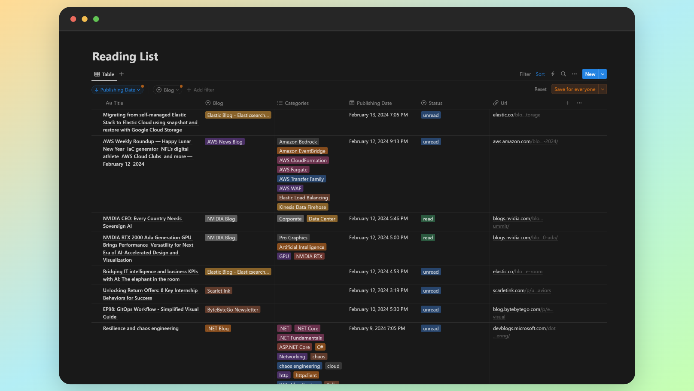

# Reading list

## How to use it

1. Fork this repository

2. You'll have to create a Notion integration, this will provide you with an API key. Follow the instructions [here](https://developers.notion.com/docs/create-a-notion-integration#create-your-integration-in-notion).

3. Create a new page, select `table` as type

4. Attach a new data source to the table page

5. Add a connection to your integration

6. Add secrets to the repository settings:
    - **NOTION_API_URL**: this value should be the notion API url (`https://api.notion.com/v1/`)
    - **NOTION_API_SECRET**: the integration secret you created earlier
    - **NOTION_API_VERSION**: the api version (latest is `2022-06-28`)
    - **NOTION_DATABASE_ID**: the id of the page you created earlier

7. Edit the [config.csv](./resources/config.csv) file with RSS feeds that you want to add to Notion

8. Manually trigger the [1_setup_database.yml](./.github/workflows/1_setup_database.yml) action

9. Manually trigger the [2_run_import_no_restrictions.yml](./.github/workflows/2_run_import_no_restrictions.yml) action (optional, this will import all feeds regardless of publish date)

10. The [3_run_daily.yml](./.github/workflows/3_run_daily.yml) action will run daily at midnight and will import any articles which were published in the last 24 hours. 

If all goes well, you'll have a database in Notion filled with articles to read and you can set/change status as you wish:

## What's the point of this

I'm on a journey to learn Go & side projects are the best way for me to do so. 

Lately, I've been ignoring newsletters that I'm subscribed to via e-mail and they end up getting lost between everything else.

This tool is supposed to capture the RSS feeds of blogs I like and save them in a Notion database, on a daily basis.

This way, I'll be able to catch up on reading in a more structured way.

Before starting development, I set some goals for myself & learn a lot because of it:

- **Getting familiar with Go syntax and concepts**: this was my first time using the language, while a lot of the concepts are not that different from stuff I already now, some things did take some time to get used to. For example, type declarations come after variable names. Pointer syntax was also throwing me off a bit in the beginning. The lack of classes felt strange having spent so much time in C# before. Overall, this has been a positive experience but I still need to get used to some concepts that feel "unnatural" currently

- **Use standard Go packages only**: I wanted to use the standard library only to avoid too many abstractions and not get lost in package hell, before even knowing how this language works. It became apparent quite fast that Go misses features I've gotten used to having in other languages. After some time I didn't miss them at all, because you can still easily get things done. There's not much bells and whistles in Go, some might say it's boring, but it's very effective. 
(by limiting myself to these packages, I also learnt how much I dislike working with the Notion REST API, I'm sure there's a great Go bindings library for it, in the future I'd use that probably).

- **Use Go routines, channels & wait groups**: The one thing you read about Go, is how great its concurrency model is. I must admit, I struggled quite a bit making things work and I've probably done it in a horrible way. But after the concept "clicked", I quite love it and I already can't wait to try it in a project that might be more suitable for it.

- **Check out unit testing abilities**: I didn't want to spend too much time on this for a small tool project that I probably won't touch again. In the end I did write a couple of tests simply because of how easy it is to setup. I'll need to explore it more in the future.

In the end, this is a quick and dirty side project, but hey, I learnt something and I can read my newsletters in peace now.